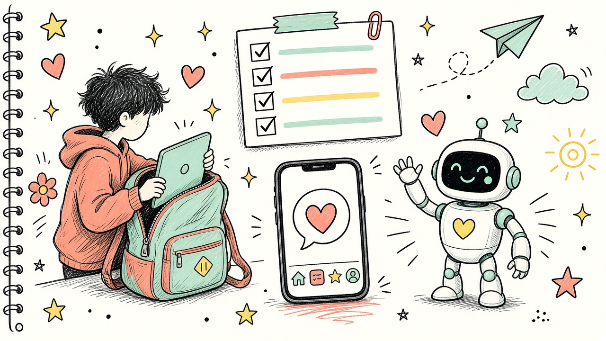

# После пары 2 — что сделать студентам

<div align="center">



**До пары 3:** каркас с табами готов,  
спека на `useState` написана, PR обновлён.

</div>

---

## Обязательный минимум

### 1. Добить практику пары 2

- [ ] `WelcomeScreen` по спеке
- [ ] Bottom Tabs, **минимум 2** вкладки (лучше 3)
- [ ] Вкладка-заглушка «Скоро: useState»
- [ ] Экраны в `screens/`
- [ ] Коммит + пуш + PR обновлён

### 2. README

В своём `README.md` добавь блок:

```markdown
## Пара 2
- Сделал Welcome-экран
- Подключил Bottom Tabs: Home / Labs / …
- Чем пользовался (ИИ / сам): …
```

### 3. Спека к паре 3

Файл `SPECS/lab-usestate.md`:

```text
Цель: учебный экран-счётчик на useState.

Стек: Expo + TypeScript, отдельная вкладка Labs или Counter.
UI: число по центру; кнопки +, −, Reset.
Поведение: старт 0; − не ниже 0; Reset → 0.
Ограничения: только useState + StyleSheet; без библиотек.
Готово, если: три кнопки работают, экран в табах, код объясним на защите.
Не делаем: AsyncStorage, сервер, анимации.
```

---

## Как понять, что готов к паре 3

За 5 минут показываешь:

1. Работающие табы  
2. Welcome на Home  
3. Файл спеки `lab-usestate.md`  
4. Зелёный / живой `expo start`  

---

## Если не успел на паре

| Застрял на | Минимум к следующей паре |
|---|---|
| Навигация | Хотя бы Welcome открывается; табы добить к началу пары 3 |
| Стили | Простой экран без красоты — ок |
| PR | Главное — пуш в fork; PR можно поправить |

Не молчи до пары: напиши в чат, если Expo/навигация не встают.

---

## По желанию (плюсы)

- [ ] Иконки у табов (`tabBarIcon`)
- [ ] Отдельный `About` с ФИО и группой
- [ ] Короткое видео/скрин табов в README

---

## Анонс пары 3

Лаба **`useState`**: экран-счётчик на отдельной вкладке.  
Кто придёт со спекой — сделает быстрее.

---

*Дедлайн — до начала пары 3, если препод не сказал иначе.*
